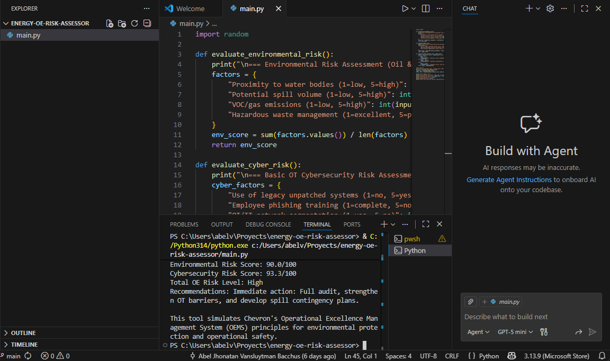

# Energy OE Risk Assessor

A Python-based console tool for assessing operational risks in the energy sector, with a focus on environmental and Operational Technology (OT) cybersecurity factors.

## Description
This application simulates principles from Chevron's Operational Excellence Management System (OEMS) by:
- Evaluating common environmental risks in oil & gas (spills, emissions, waste management).
- Assessing basic OT cybersecurity risks (legacy systems, phishing training, network segmentation).

It computes a weighted score (60% environmental, 40% cybersecurity) and provides actionable mitigation recommendations.

## Motivation
Built by a legal expert in environmental compliance and regulation in Venezuela, blending real-world investigative experience with self-taught cybersecurity skills. Created to showcase transferable analytical abilities for Operational Excellence roles in energy.

## Sample Outputs




## How to Run
```bash
python main.py
